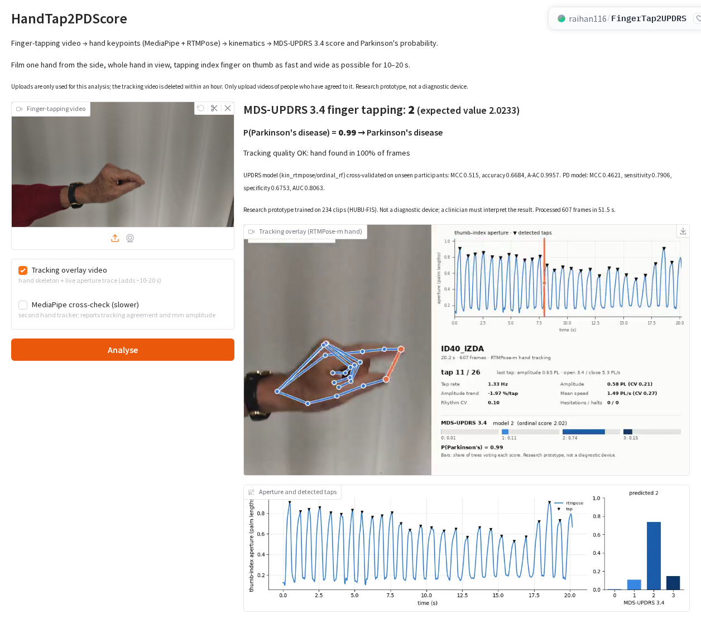
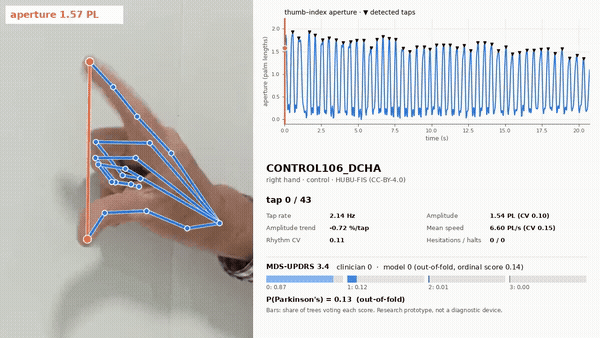
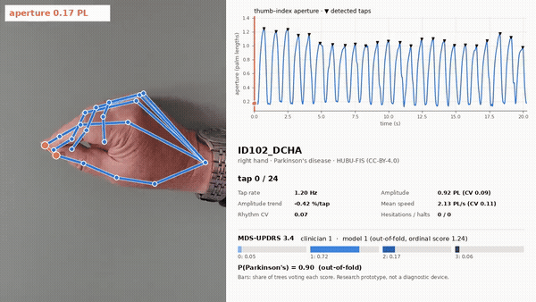
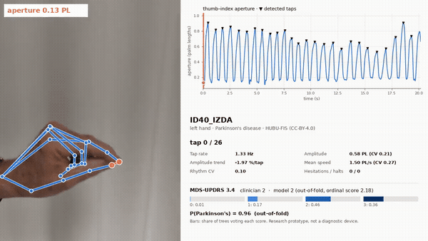
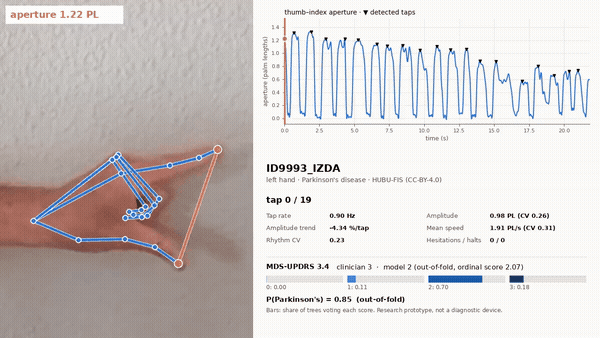
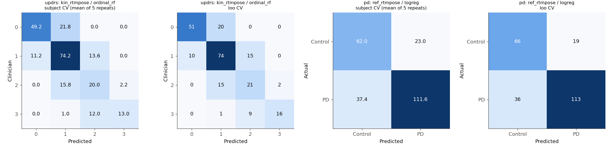
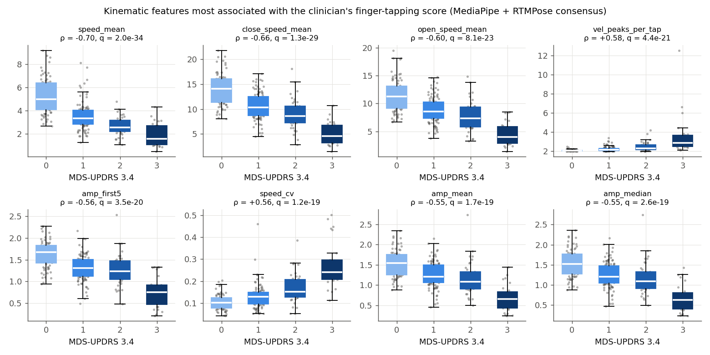
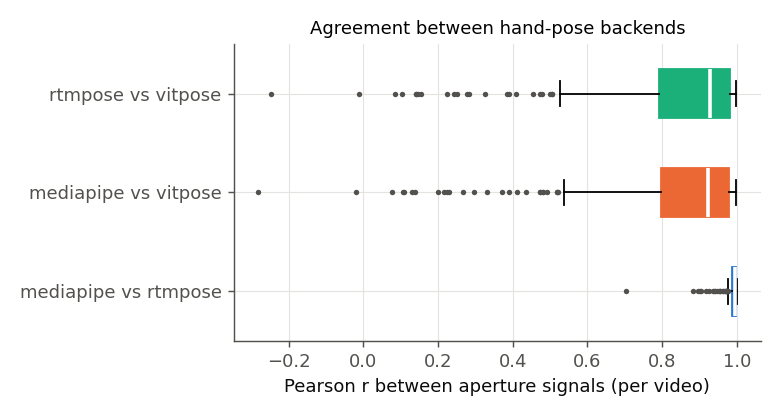

# FingerTap2UPDRS

**Video-based finger-tapping kinematics for Parkinson's disease: from a phone video of the
MDS-UPDRS 3.4 finger-tapping task to hand keypoints, interpretable tapping kinematics, an
MDS-UPDRS 3.4 score (0–3) and a Parkinson's-vs-control probability.**

[](https://doi.org/10.5281/zenodo.17738775)


[](https://raihan116-fingertap2updrs.hf.space)

> Research prototype. Trained and validated on a single dataset (HUBU-FIS, 234 videos,
> 118 participants).

## Live app

**Try it in the browser: <https://raihan116-fingertap2updrs.hf.space>**. No installation or
login is needed. Upload (or record) a 10–20 s finger-tapping video and click **Analyse**. The app
returns the MDS-UPDRS 3.4 score, P(Parkinson's), a tracking-overlay video, the aperture trace and
every kinematic metric, with a JSON download. A 20 s clip takes about 1–1.5 minutes on the Space's 2 CPUs.

[](https://raihan116-fingertap2updrs.hf.space)

<sub>Screenshot of the live app analysing HUBU-FIS clip `ID40_IZDA` (clinician score 2). The
deployed models were trained on all 234 clips, so this result is in-sample. The out-of-fold
results are in [Demo](#demo). The same server exposes a REST API (`POST /api/predict`, add
`?overlay=true` for the tracking video) for custom front ends.</sub>

## Demo

Kinematic overlays from the best pose backend (RTMDet + RTMPose-m hand). One clip per
clinician score, drawn at random (fixed seed) from well-tracked videos. The UPDRS score and P(PD) in the panel
are **out-of-fold** predictions from models that never saw that participant.

| Clinician 0 · predicted 0 · control | Clinician 1 · predicted 1 · PD |
|:---:|:---:|
|  |  |
| [full video](docs/media/CONTROL106_DCHA_overlay.mp4) | [full video](docs/media/ID102_DCHA_overlay.mp4) |
| **Clinician 2 · predicted 2 · PD** | **Clinician 3 · predicted 2 · PD** |
|  |  |
| [full video](docs/media/ID40_IZDA_overlay.mp4) | [full video](docs/media/ID9993_IZDA_overlay.mp4) |

Left: RTMPose-m hand skeleton, with the thumb–index aperture in orange. Right: the aperture
trace with detected taps (▼) and a playhead, the clip's kinematic summary, and the model
output. The GIFs show the first 6 s; the linked MP4s show the whole clip. The score-3 clip
shows the amplitude decrement (−4.3 %tap) that the model under-scores as 2.

## Dataset

This work uses the **HUBU-FIS Finger Tapping dataset** (Amo-Salas, García-Bustillo & Cubo, 2025),
<https://zenodo.org/records/17738775>, DOI [10.5281/zenodo.17738775](https://doi.org/10.5281/zenodo.17738775),
licensed **CC-BY-4.0**. It contains 234 videos (≈20 s, 30 fps, mostly 1080×1920 phone clips) of
the finger-tapping test performed by controls and people with Parkinson's disease at the
University of Burgos / Hospital Universitario de Burgos (project PI19/00670, ISCIII, Spain).
Each hand was rated on MDS-UPDRS item 3.4 by clinicians.

| | UPDRS 0 | UPDRS 1 | UPDRS 2 | UPDRS 3 | Total |
|---|---:|---:|---:|---:|---:|
| Control videos (`CONTROLxx`) | 58 | 27 | – | – | 85 |
| PD videos (`IDxx`) | 13 | 72 | 38 | 26 | 149 |

There are 118 participants, each with a right-hand (`_DCHA`) and a left-hand (`_IZDA`) clip; two
participants have one clip only. No clip is rated 4. Eight clips are `.MOV`, the rest `.mp4`.

The labels file `fis_diagnostic.csv` is included here. The videos are **not**: download
`HUBU-FIS_FT.zip` from Zenodo and unpack it so that:

```
data/videos_FIS/
├── fis_diagnostic.csv      # ID,UPDRS
└── videos/                 # CONTROL01_DCHA.mp4, ..., ID9998_IZDA.mp4 (234 files)
```


## Installation

Python 3.10 on Linux or macOS. No GPU is needed.

```bash
git clone https://github.com/RaihanSabique/FingerTap2UPDRS.git
cd FingerTap2UPDRS
python3.10 -m venv .venv && source .venv/bin/activate
pip install -r requirements.txt
python scripts/download_models.py            # MediaPipe + RTMDet + RTMPose (~67 MB)
python scripts/download_models.py --vitpose  # optional: ViTPose-B wholebody (360 MB, research only)
```

## Quick start

**Command line**

```bash
python -m handtap.predict my_tapping_clip.mp4 --json result.json --plot result.png
```

Example output for `ID9993_IZDA` (clinician score 3):

```
MDS-UPDRS 3.4 finger tapping: 3 (expected 2.6633, p={'0': 0.0033, '1': 0.05, '2': 0.2267, '3': 0.72})
P(Parkinson's) = 0.98 -> Parkinson's disease
taps 19, rate 0.8971 Hz, amplitude 0.9761 PL, amp trend -4.3428 %/tap, hesitations 0
```


**Python**

```python
from handtap.predict import HandTapPredictor, plot_result

predictor = HandTapPredictor()                      # loads models/classifier/*.joblib
res = predictor.predict("my_tapping_clip.mp4")      # JSON-serialisable dict
res["prediction"]["updrs"]["score"], res["prediction"]["pd"]["probability"]
res["kinematics"]["amp_slope_pct"]                  # {'value': ..., 'unit': '%/tap', ...}
plot_result(res, "result.png")
```

**Web app** at <http://localhost:7860>:

```bash
python app/app.py
```

Recording tips: film one hand from the side with the whole hand in view, and tap the index
finger on the thumb as fast and as wide as possible for 10–20 s.

## Results

Participant-grouped nested CV, mean ± SD over 5 repeats. The full tables for all 6 feature sets ×
6 models, the leave-one-video-out numbers and the per-participant results are in
[outputs/results/RESULTS.md](outputs/results/RESULTS.md).

| Task | Deployed model | MCC | F1 | Accuracy | A-AC | Precision | Recall |
|---|---|---|---|---|---|---|---|
| MDS-UPDRS 3.4 (0–3) | RTMPose kinematics + ordinal RF | 0.515 ± 0.015 | 0.671 ± 0.011 | 0.668 ± 0.010 | 0.996 ± 0.000 | 0.692 ± 0.009 | 0.668 ± 0.010 |
| PD vs control (per video) | RTMPose kinematics + RF | 0.462 ± 0.041 | 0.750 ± 0.019 | 0.749 ± 0.018 | – | 0.751 ± 0.019 | 0.749 ± 0.018 |

| Confusion matrices (best model; subject CV, averaged over repeats, and LOO) |
|:---:|
|  |

| Features most associated with the clinician's score | Pose-backend agreement |
|:---:|:---:|
|  |  |

## Acknowledgements

The HUBU-FIS dataset was collected by the University of Burgos and the Hospital Universitario de
Burgos, supported by project PI19/00670 of the Ministerio de Ciencia, Innovación y Universidades,
Instituto de Salud Carlos III, Spain. The dataset authors thank the participants, the Parkinson's
Disease Association, and Dr. Gámez Leiva and Dr. Madrigal for the video assessments. Pretrained
weights: Google MediaPipe (Apache-2.0), OpenMMLab RTMPose / RTMDet (Apache-2.0) and
easy_ViTPose / ViTPose (Apache-2.0).
